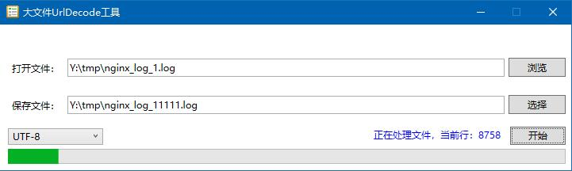
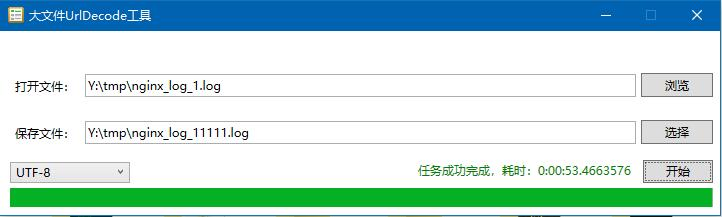

# OhMyDev
噢，我的开发工具集！

# 为什么会有这个工具？
其实很简单，原因是我要分析nginx日志，但是日志超级大，200GB起步，而且都是UrlEncoded的了，我想要转码，可是那么大的数据，没有一个友好的工具怎么能行呢？所以就自己写了一个。

# 来张图

这是正在运行：

这是完成之后：

# 技术贴
这个工程写的时候用的是WPF的技术，所以运行期间你会听见电脑风扇的声音，但那不是你的CPU在忙碌，而是使用的GPU，所以不会对你的电脑造成卡顿的。
